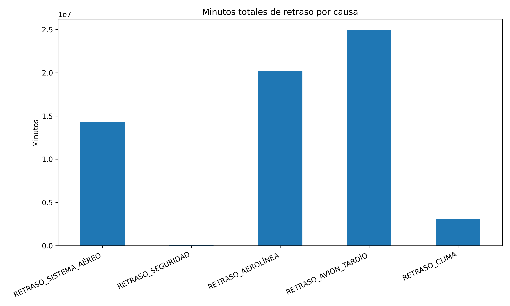

# ✈️FlightOnTime
# VARIABLES EXPLICATIVAS DE LAS CAUSAS QUE INFLUYEN EN LOS RETRASOS GRAVES

# 🚀 INTRODUCCIÓN 

El proyecto **FlightOnTime** consiste desarrollar una solución predictiva capaz de estimar si un vuelo va a despegar a tiempo o con retraso. 

# 🎯 Objetivos relacionados al cliente

## Para los pasajeros
- Recibir alertas tempranas sobre posibles retrasos antes de salir de casa.
- Tomar decisiones informadas sobre su itinerario y reducir tiempos de espera innecesarios.
## Para las aerolíneas
- Ajustar la operación en función de la probabilidad de retraso.
- Minimizar el impacto en la programación de vuelos y en la experiencia del cliente.
- Optimizar recursos como tripulación y mantenimiento preventivo.
## Para los aeropuertos
- Planificar mejor el uso de la infraestructura (puertas de embarque, pistas, personal).
- Reducir la congestión y mejorar la eficiencia operativa.
- Coordinar con aerolíneas y servicios de apoyo para anticipar escenarios críticos.

# 🎯 Objetivos de mercado
  
**1.- Validar la utilidad de la ciencia de datos en transporte aéreo**
Demostrar que la predicción de retrasos es una aplicación práctica y con impacto directo en la industria.

**2.- Generar un diferencial competitivo para aerolíneas y startups**
Ofrecer modelos predictivos que permitan anticipar riesgos y posicionarse como líderes en innovación.

**3.- Mejorar la puntualidad y planificación de flota**
Facilitar la toma de decisiones estratégicas en la operación diaria, optimizando recursos y horarios.

**4.- Reducir costos operativos y quejas de clientes**
Minimizar pérdidas asociadas a retrasos y mejorar la percepción del servicio.

**5.- Aumentar la satisfacción del cliente mediante transparencia**
Proveer información clara y anticipada que fortalezca la confianza en las aerolíneas.

**6.- Identificar patrones de riesgo en horarios y aeropuertos**
Usar incluso modelos simples para detectar puntos críticos, aportando valor inmediato al sector.

# ✨ Características 

Manipular datos en **flights2015.parquet**, contribuye a mejorar:

1.- Formato:  Binario, columnas

2.- Compresión:  Alta compresión, ocupa mucho menos espacio

3.- Lectura/Escritura:  Optimizado para lectura selectiva

4.- Estructura:  Mantiene tipos (int, float, string, etc.)

5.- Escalabilidad:  Ideal para big data y sistemas distribuidos

6.- Compatibilidad:  Requiere librerías (pandas, pyarrow, spark)

# 📑 Estructura de datos: 

El conjunto de datos incluye la siguiente información:

| NOMBRE |DESCRIPCIÓN                                          |
|--------|-----------------------------------------------------|
| AÑO    |  Año en que se realizó o estaba programado el vuelo.|
|MES  | Mes del vuelo (1 = enero, 12 = diciembre). |
|DÍA  | Día del mes en que ocurrió el vuelo. |
|DÍA_SEMANA  | Día de la semana (1 = lunes, 7 = domingo). |
| AEROLÍNEA |  Código de la aerolínea que opera el vuelo (ej. AA = American Airlines, WN = Southwest).|
|NÚMERO_VUELO  | Número de vuelo asignado por la aerolínea. |
| NÚMERO_DEL_AVIÓN  | Matrícula única del avión, como la “placa” de un automóvil (ej. N485HA). |
| AEROPUERTO_ORIGEN | Código IATA del aeropuerto desde donde despega el vuelo. |
| AEROPUERTO_DESTINO | Código IATA del aeropuerto donde aterriza el vuelo. |
| SALIDA_PROGRAMADA | Hora programada de salida (formato HHMM). |
| HORA_LLEGADA | Hora real en que el avión llegó al aeropuerto destino. |
|HORA_SALIDA | Hora real en que el avión sale del aeropuerto origen. |
| RETRASO_LLEGADA | Diferencia en minutos entre la hora real de llegada y la programada (positivo = retraso, negativo = adelantado). |
|DESVIADO  | Indica si el vuelo fue desviado a otro aeropuerto (1 = sí, 0 = no). |
|CANCELADO  | Indica si el vuelo fue cancelado (1 = sí, 0 = no). |
| RAZÓN_CANCELACIÓN |Motivo de cancelación: A = sistema aéreo, B = seguridad, C = aerolínea, D = clima.  |
| RETRASO_SISTEMA_AÉREO |Minutos de retraso atribuibles al sistema aéreo (congestión, control de tráfico aéreo).
|RETRASO_SEGURIDAD  |Minutos de retraso por controles o incidentes de seguridad.  |
| RETRASO_AEROLÍNEA | Minutos de retraso atribuibles a la aerolínea (tripulación, mantenimiento, logística interna). |
|RETRASO_AVIÓN_TARDÍO  | Minutos de retraso porque el avión llegó tarde de un vuelo anterior (efecto cascada). |
| RETRASO_CLIMA | Minutos de retraso por condiciones meteorológicas adversas (tormentas, nieve, niebla, viento). |
|TIEMPO_PROGRAMADO|Es la duración estimada del vuelo según el plan de la aerolínea (en minutos)|
|TIEMPO_TOTAL_REAL|Es el tiempo que realmente tomó el vuelo desde la salida hasta la llegada, incluyendo rodaje de salida y rodaje de entrada.|
|TIEMPO_EN_AIRE|Es el tiempo que el avión estuvo efectivamente volando, desde el despegue hasta el aterrizaje.|
|DISTANCIA|Registra la distancia de los vuelos en kilómetros|

# 🖌️ DESCRIPCIÓN 

1.- El dataset contiene más de 5.8 millones de vuelos.

2.- ATL (Atlanta) es el aeropuerto más importante tanto en salidas como en llegadas.

3.- La flota tiene casi 5,000 aviones distintos, pero algunos operan mucho más que otros.

4.- Más del 98% de los vuelos no se cancelan, lo que indica que las cancelaciones son excepcionales.

5.- Análisis para reconocer las variables que influyen en los retrasos graves, para ello se realiza un gráfico de barra que se muestra a continuación:

**- RETRASO_AVIÓN_TARDÍO** no es una causa primaria, sino más bien un efecto acumulado. Se refiere a los minutos de retraso que un vuelo hereda porque el avión llegó tarde de un vuelo anterior. Ese retraso puede estar explicado por cualquiera de las otras causas:
  -  RETRASO_CLIMA → si el vuelo anterior se demoró por tormenta.
  -  RETRASO_AEROLÍNEA → si hubo problemas operativos o logísticos.
  -  RETRASO_SISTEMA_AÉREO → congestión en el tráfico aéreo.
  -  RETRASO_SEGURIDAD → inspecciones adicionales.

**📊 Interpretación de retrasos por rango de minuto consideradas en el pryecto para evaluar los retrasos graves.**

Esta clasificación no corresponde a un estándar oficial de la industria aérea. Se adopta como convención interna del proyecto, inspirada en prácticas comunes de aerolíneas y autoridades de transporte, para facilitar la interpretación y comunicación de los resultados.

| Categoría de retraso | Rango en minutos | Interpretación |
|----------------------|------------------|----------------|
|Puntualidad aceptada  | 0–15 | Normal, sin impacto significativo |
|Retraso leve  |16–30  | Aún tolerable, frecuente en operaciones |
|Retraso moderado  |31–60  | Ya afecta conexiones y logística |
| Retraso grave |  >60| Impacto fuerte en pasajeros y aerolínea |
|Retraso extremo|>180|Casos excepcionales, suelen implicar compensaciones|

**Factores correlacionados con retrasos superiores a 30 minutos:**

| Retrasos| Correlación|
|----------------|---------------|
|RETRASO_GRAVE|           1.000000|
|||
|RETRASO_AVIÓN_TARDÍO|    0.535315|
|||
|RETRASO_AEROLÍNEA|       0.389211|
|||
|RETRASO_SISTEMA_AÉREO|   0.248072|
|||
|RETRASO_CLIMA|           0.156599|
|||
|LLEGADA_PROGRAMA|        0.109532|
|||
|RETRASO_SEGURIDAD|       0.029881|

- Consistencia absoluta: **RETRASO_AVIÓN_TARDÍO y RETRASO_AEROLÍNEA** son los más fuertes en todos los métodos.
- Diferencias: CatBoost amplifica el rol de **SISTEMA_AÉREO y CLIMA**, lo que sugiere que captura mejor interacciones no lineales.
- Ruido: SEGURIDAD y LLEGADA_PROGRAMA son irrelevantes en todos los enfoques.

El modelo usado para clasificar los retrasos graves corresponde a **"Pipeline de machine learning XGBoost y CatBoost"**:

El pipeline completo incluye:

Entrenamiento de XGBoost y CatBoost con las variables más fuertes: RETRASO_AVIÓN_TARDÍO, RETRASO_AEROLÍNEA, RETRASO_SISTEMA_AÉREO, RETRASO_CLIMA.

Priorizar las dos variables clave (AVIÓN_TARDÍO y AEROLÍNEA).
Explorar interacciones con SISTEMA_AÉREO y CLIMA, que CatBoost detecta mejor.
Creación del ensemble (promedio de probabilidades). Esto suaviza las diferencias y equilibra recall y precisión.

Evaluación final con el umbral 0.6 (matriz de confusión + reporte).

**Rsultados otenidos:**

- Matriz de confusión
  
- Dataset limpio llamado: flight_clean.csv

 
# 📂 Archivos del Proyecto 

Parquet: Archivos que contienen las bases de datos de cada aerolínea.

Jupyter Notebook: Proyecto desarrollado en Google Colaboratory, utilizando Python y bibliotecas como Pandas para realizar el análisis de datos.

# 💻Lenguaje y Bibliotecas Utilizadas 

Lenguaje:

- Python

**📚 Bibliotecas Principales:** 

- Pandas: Manipulación y análisis de datos estructurados.
- NumPy: Trabajo con arrays multidimensionales y cálculos matemáticos.
- Matplotlib: Creación de gráficos y visualizaciones de datos.
- Seaborn: Biblioteca avanzada para visualizaciones estadísticas y estilizadas, ideal para explorar datos y destacar relaciones entre variables.
- XGBoost: Biblioteca de Extreme Gradient Boosting, optimizada para velocidad y rendimiento en clasificación y regresión.
- CatBoost: Biblioteca de Categorical Boosting, especializada en manejar eficientemente variables categóricas y reducir el riesgo de overfitting.

# 💽 Instalación 

Ejecuta el siguiente comando para instalar las bibliotecas necesarias:

pip install pandas numpy matplotlib

# 🚀 Instrucciones para Ejecutar

Clona este repositorio en tu máquina local: ´´´bash
git clone https://github.com/Marion13673/Analisis-ventas-por-tienda.git

Abre el archivo index.html en tu navegador para ver y usar la aplicación.

# 🤝 Contribuciones

💡 ¡Las contribuciones son bienvenidas! Si deseas contribuir a este proyecto, por favor sigue estos pasos:

**Haz un fork del repositorio.**

Crea una rama con tu nueva característica (git checkout -b feature/nueva-caracteristica).

Realiza tus cambios y haz un commit (git commit -m 'Añadir nueva característica').

Envía tu rama al repositorio remoto (git push origin feature/nueva-caracteristica).

Abre una Pull Request.

# 📜 Licencia** 

📄 Este proyecto está licenciado bajo la Licencia MIT. Consulta el archivo LICENSE para más información.
